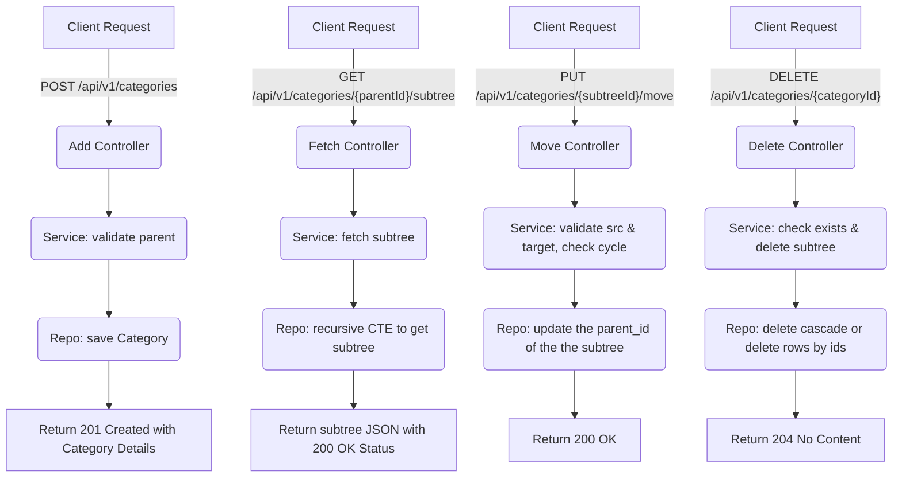

# Event Categories - Spring Boot

This project implements a **REST API** to manage hierarchical event categories (infinite-depth tree).

## Tech Stack
- Java 17
- Docker
- Maven
- Spring Boot 3.1.5
- PostgreSQL 14
- JPA / Hibernate
- OpenAPI (Swagger UI)
- Unit Tests
- JaCoCo for coverage reports

## How to Run

1. Start the PostgreSQL database using Docker (run inside project directory):
   ```bash
   docker compose up -d
2. Run: `mvn clean install` to package and run test cases.
3. Run: `mvn spring-boot:run` or `java -jar target/event-management-0.0.1-SNAPSHOT.jar` to start the application.
4. Access API documentation (Swagger UI) at: http://localhost:8082/swagger-ui.html.
5. Goto `target/site/jacoco/index.html` for test coverage details.

### OPERATIONAL FLOW CHART [TD]


